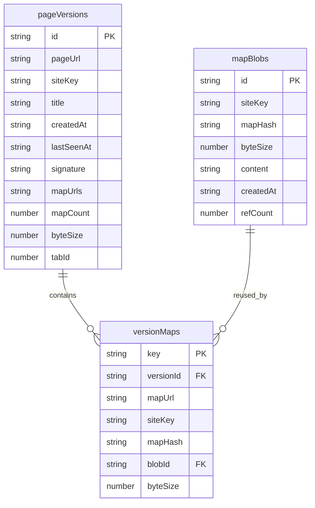
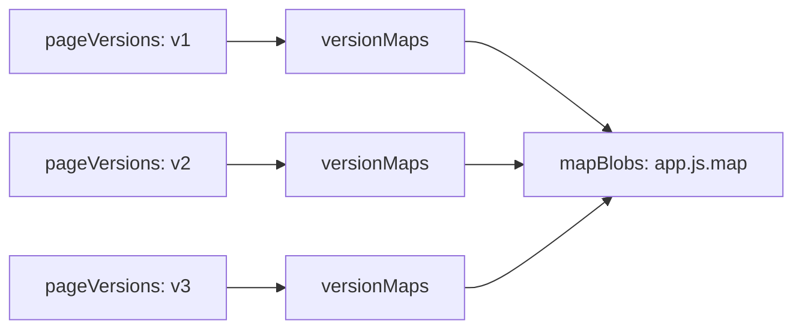

# SourceD 架构与存储设计

本文档说明 SourceD 的运行架构、IndexedDB 存储模型，以及“多个版本复用同一个 map 内容”的设计。

## 核心模块职责

- `runtime.mjs`: 注册浏览器事件、消息通道和 UI 交互入口。
- `sessions.mjs`: 维护当前 tab 的采集会话，把实时抓到的 map 聚合成待持久化版本。
- `storage.mjs`: 负责版本写入、删除、压缩、导入和汇总。
- `db.mjs`: 对 IndexedDB 做最薄的一层访问封装。
- `popup` / `dashboard` / `options`: 读取汇总结果、展示历史、触发下载和清理操作。

## 数据写入链路

1. `chrome.webRequest` 观察页面请求到的 JS 资源。
2. background 解析 `sourceMappingURL`，拉取 `.map` 或 inline source map。
3. `sessions.mjs` 将同一页面下采集到的 map 放入 `session.maps`。
4. 定时触发 `upsertSessionVersion()`，把当前页面快照整理为一个 version。
5. `storage.mjs` 将 version 元数据、version 与 map 的关联、以及去重后的 map 内容分别写入 IndexedDB。

## 数据存储图

## 表职责与逻辑关系

### `pageVersions`

- 一条记录代表某个 `pageUrl` 在某个时间点的一次 source map 快照。
- `signature` 由 `mapUrl + mapHash` 排序拼接而成，用来判断当前页面版本是否与历史版本完全一致。
- `mapUrls` 是该版本包含的 map URL 列表。文档图里按逻辑字段展示，真实关联关系存放在 `versionMaps`。

### `versionMaps`

- 这是 version 和 map blob 之间的关联表。
- 主键 `key` 对应实现里的 `versionId::mapUrl`。
- 一条记录表示“某个版本引用了某个 map URL，对应的内容落在某个 `blobId` 上”。
- 关系上是：
  - `pageVersions 1 -> N versionMaps`
  - `mapBlobs 1 -> N versionMaps`
- 因而整体上 `pageVersions` 和 `mapBlobs` 是一个通过 `versionMaps` 建立的多对多逻辑关系。

### `mapBlobs`

- 保存去重后的 source map 实际内容 `content`。
- `id = siteKey::mapHash`，表示同一站点下、同一内容的 map 只存一份。
- `refCount` 表示当前有多少条 `versionMaps` 在引用这个 blob，用于删除版本时回收无人引用的 map 内容。

## 复用同一个 map 的设计点

SourceD 的复用设计不直接把完整 map 内容存进每个 version，而是拆成：

- `pageVersions`: 保存版本快照元信息
- `versionMaps`: 保存“这个版本引用了哪些 map”
- `mapBlobs`: 保存去重后的 map 内容

这样多个 version 只要满足以下条件，就会复用同一个 `mapBlobs` 记录：

- `siteKey` 相同
- map 内容完全相同
- 计算出的 `mapHash` 相同

对应效果：

- 同一页面反复访问，如果某个 map 内容没变，新 version 只新增一条 `versionMaps` 引用，不重复存 `content`
- 同一站点下不同页面，如果引用了内容相同的 map，也会复用同一个 blob
- 删除旧版本时，只减少 `refCount`；只有 `refCount` 归零时，才真正删除该 map 内容

可抽象为下面这组关系：

这里体现的是：`v1`、`v2`、`v3` 可以各自是不同时间的页面版本，但只要它们引用的某个 map 内容一致，就都指向同一个 blob。

## 一个典型例子

假设页面 `https://example.com/app` 被访问了三次：

- 第一次得到 `vendor.js.map` 和 `app.js.map`
- 第二次只有 `app.js.map` 内容变化，`vendor.js.map` 不变
- 第三次两个 map 都未变化

那么存储结果通常会是：

- `pageVersions`: 3 条版本记录
- `versionMaps`: 每个版本各自记录自己引用的 map
- `mapBlobs`:
  - `vendor.js.map` 只存 1 份，被多个版本复用
  - `app.js.map` 至少存 2 份，因为出现过不同内容版本

## 设计收益

- 降低重复存储，尤其适合长期保留历史版本时的场景。
- 让“页面版本历史”与“map 内容实体”分离，便于做压缩、清理和导入。
- 基于 `refCount` 可以安全回收不再被任何版本引用的 map 内容。

## 实现对应

- 版本构建: `src/background/sessions.mjs`
- 持久化与引用计数维护: `src/background/storage.mjs`
- IndexedDB 定义与加载: `src/background/db.mjs`
- Store 常量与 key 规则: `src/background/shared.mjs`
